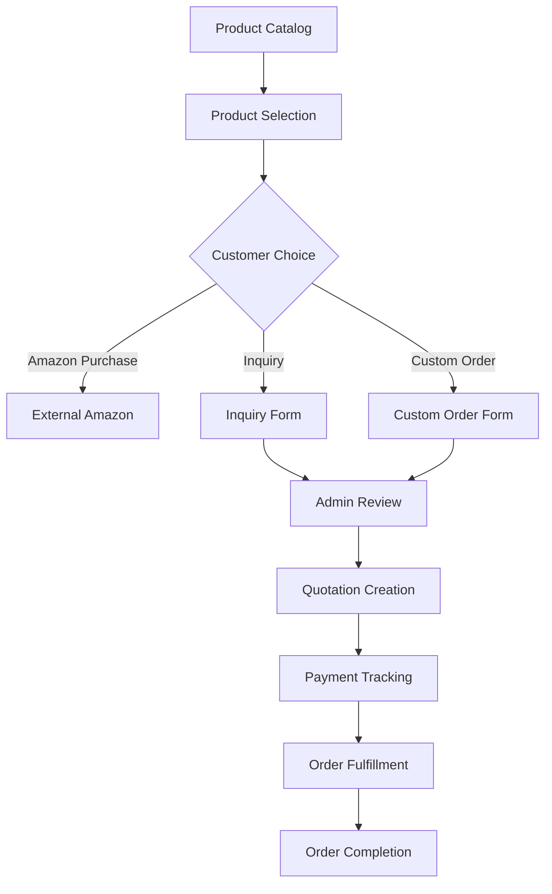

# Custom Orders and Inquiries System Enhancement Requirements

## 1. Product Overview

This document outlines comprehensive improvements to the custom orders and inquiries system, addressing product selection issues, Amazon integration, quotation management, and admin functionality enhancements. The system will provide seamless customer experience for both product inquiries and custom order requests while enabling efficient admin management with advanced quotation tracking.

## 2. Core Features

### 2.1 User Roles

| Role          | Registration Method                | Core Permissions                                                           |
| ------------- | ---------------------------------- | -------------------------------------------------------------------------- |
| Customer      | Email registration or guest access | Can submit inquiries and custom orders, view order status                  |
| Admin         | Admin invitation                   | Can manage all orders, create quotations, update statuses, manage products |
| Sales Manager | Admin assignment                   | Can view and update assigned orders, create quotations                     |

### 2.2 Feature Module

Our enhanced system consists of the following main components:

1. **Product Catalog Page**: Enhanced product display with Amazon integration, inquiry options, and improved product selection
2. **Inquiry System**: Redesigned inquiry forms with optional product association and flexible product information fields
3. **Custom Orders Management**: Fixed admin interface with operational view details, enhanced quotation system
4. **Quotation Management**: Advanced pricing system with bill numbers, payment tracking, and balance calculations
5. **Admin Dashboard**: Comprehensive order management with status tracking and communication tools

### 2.3 Page Details

| Page Name            | Module Name                  | Feature description                                                                                    |
| -------------------- | ---------------------------- | ------------------------------------------------------------------------------------------------------ |
| Product Catalog      | Product Display              | Enhanced product cards with Amazon buy buttons, inquiry options, and improved product selection flow   |
| Product Catalog      | Amazon Integration           | "Buy this product from Amazon" icon with external link functionality while maintaining inquiry options |
| Inquiry Form         | Flexible Product Association | Optional product selection with ability to submit inquiries without specific product information       |
| Inquiry Form         | Enhanced Product Fields      | Additional fields for product specifications, custom requirements, and detailed product information    |
| Admin Custom Orders  | Order Details View           | Fixed view details functionality with comprehensive order information display                          |
| Admin Custom Orders  | Logo Display Fix             | Proper display of uploaded customer logos in order details                                             |
| Quotation Management | Price Tag System             | Automated price tag creation when status changes to 'Quoted'                                           |
| Quotation Management | Payment Tracking             | Track received amounts, calculate balances, and manage payment status                                  |
| Quotation Management | Bill Number System           | Automatic bill number assignment with sequential numbering                                             |
| Admin Products       | Amazon URL Management        | Add and manage Amazon product URLs in admin interface                                                  |

## 3. Core Process

### Customer Flow

1. Customer browses product catalog
2. Customer can either:

   * Click "Buy from Amazon" for direct purchase

   * Submit inquiry with or without specific product selection

   * Request custom order with detailed specifications
3. Admin receives and processes inquiries/orders
4. Admin creates quotations with pricing and bill numbers
5. Customer receives quotation and makes payment
6. Admin tracks payments and manages order fulfillment

### Admin Flow

1. Admin manages product catalog with Amazon URLs
2. Admin reviews incoming inquiries and custom orders
3. Admin creates detailed quotations with pricing
4. Admin tracks payments and calculates balances
5. Admin updates order status through production lifecycle
6. Admin manages customer communication and order completion

## 4. User Interface Design

### 4.1 Design Style

* **Primary Colors**: Blue (#2563eb) for primary actions, Green (#16a34a) for success states

* **Secondary Colors**: Gray (#6b7280) for secondary text, Orange (#ea580c) for Amazon integration

* **Button Style**: Rounded corners (8px), subtle shadows, hover animations

* **Font**: Inter font family, 14px base size, 16px for headings

* **Layout Style**: Card-based design with clean spacing, responsive grid layouts

* **Icons**: Lucide React icons with consistent sizing and Amazon brand colors for external links

### 4.2 Page Design Overview

| Page Name        | Module Name        | UI Elements                                                                                   |
| ---------------- | ------------------ | --------------------------------------------------------------------------------------------- |
| Product Catalog  | Product Cards      | Enhanced cards with Amazon buy button (orange), inquiry button (blue), responsive grid layout |
| Product Catalog  | Amazon Integration | Orange Amazon icon with "Buy from Amazon" text, external link indicator                       |
| Inquiry Form     | Product Selection  | Optional dropdown with "No specific product" option, enhanced product fields                  |
| Admin Orders     | Details View       | Tabbed interface with order details, quotation management, payment tracking                   |
| Admin Orders     | Logo Display       | Proper image rendering with fallback states and responsive sizing                             |
| Quotation System | Price Management   | Clean pricing tables, bill number display, payment status                                     |

