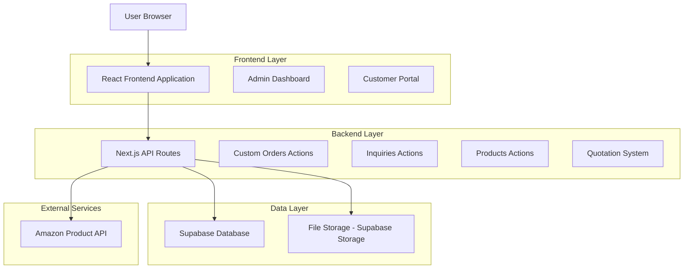
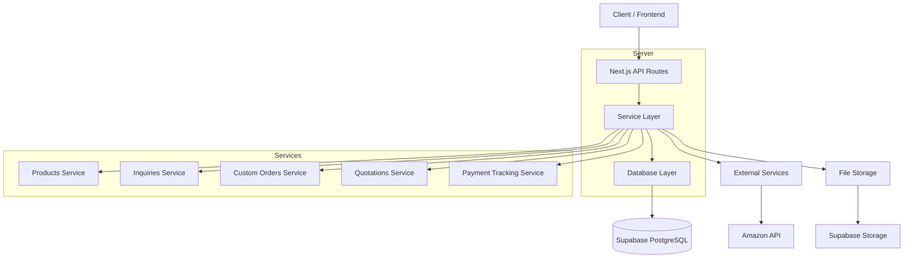
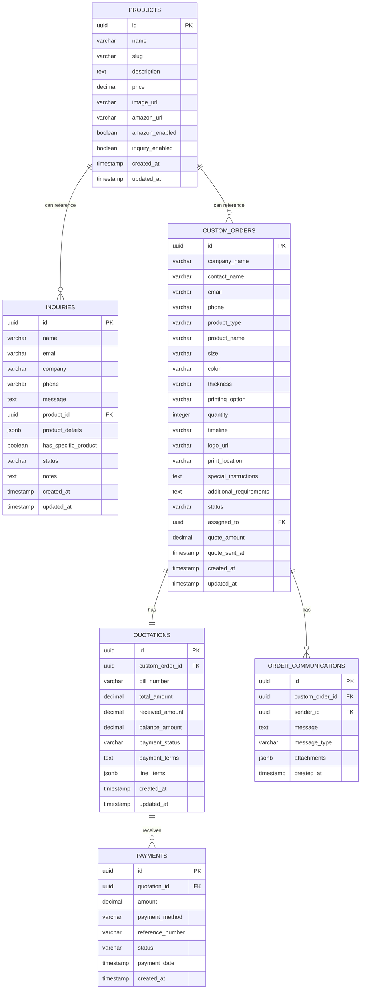

# Custom Orders and Inquiries System - Technical Architecture

## 1. Architecture Design



## 2. Technology Description

* Frontend: React\@18 + Next.js\@15 + TypeScript + Tailwind CSS + Shadcn/ui

* Backend: Next.js API Routes + Supabase SDK

* Database: Supabase (PostgreSQL)

* File Storage: Supabase Storage

* External Integration: Amazon Product Advertising API (optional)

## 3. Route Definitions

| Route                      | Purpose                                                 |
| -------------------------- | ------------------------------------------------------- |
| /products                  | Enhanced product catalog with Amazon integration        |
| /products/\[slug]          | Individual product page with inquiry and Amazon options |
| /inquiry                   | Flexible inquiry form with optional product selection   |
| /custom-order              | Custom order form with enhanced specifications          |
| /admin/products            | Product management with Amazon URL configuration        |
| /admin/custom-orders       | Enhanced custom orders management                       |
| /admin/custom-orders/\[id] | Fixed order details view with quotation system          |
| /admin/inquiries           | Improved inquiries management                           |
| /admin/quotations          | New quotation management interface                      |

## 4. API Definitions

### 4.1 Enhanced Products API

**Get Products with Amazon Integration**

```
GET /api/products
```

Response:

| Param Name       | Param Type | Description                        |
| ---------------- | ---------- | ---------------------------------- |
| id               | UUID       | Product identifier                 |
| name             | string     | Product name                       |
| amazon\_url      | string     | Amazon product URL                 |
| has\_amazon      | boolean    | Whether Amazon option is available |
| inquiry\_enabled | boolean    | Whether inquiry is enabled         |

**Update Product with Amazon URL**

```
PUT /api/products/[id]
```

Request:

| Param Name      | Param Type | isRequired | Description               |
| --------------- | ---------- | ---------- | ------------------------- |
| amazon\_url     | string     | false      | Amazon product URL        |
| amazon\_enabled | boolean    | false      | Enable Amazon integration |

### 4.2 Enhanced Inquiries API

**Create Flexible Inquiry**

```
POST /api/inquiries
```

Request:

| Param Name             | Param Type | isRequired | Description                             |
| ---------------------- | ---------- | ---------- | --------------------------------------- |
| name                   | string     | true       | Customer name                           |
| email                  | string     | true       | Customer email                          |
| product\_id            | UUID       | false      | Optional product reference              |
| product\_details       | object     | false      | Custom product information              |
| has\_specific\_product | boolean    | true       | Whether inquiry is for specific product |

### 4.3 Enhanced Custom Orders API

**Get Custom Order with Quotation**

```
GET /api/custom-orders/[id]
```

Response:

| Param Name        | Param Type | Description                        |
| ----------------- | ---------- | ---------------------------------- |
| id                | UUID       | Order identifier                   |
| logo\_url         | string     | Customer logo URL                  |
| quotation         | object     | Quotation details with bill number |
| payment\_tracking | object     | Payment status and balance         |

**Update Order Status with Quotation**

```
PUT /api/custom-orders/[id]/status
```

Request:

| Param Name    | Param Type | isRequired | Description                |
| ------------- | ---------- | ---------- | -------------------------- |
| status        | string     | true       | New order status           |
| quote\_amount | decimal    | false      | Quotation amount           |
| bill\_number  | string     | false      | Auto-generated bill number |

### 4.4 New Quotation Management API

**Create Quotation**

```
POST /api/quotations
```

Request:

| Param Name     | Param Type | isRequired | Description                  |
| -------------- | ---------- | ---------- | ---------------------------- |
| order\_id      | UUID       | true       | Custom order reference       |
| total\_amount  | decimal    | true       | Total quotation amount       |
| payment\_terms | string     | false      | Payment terms and conditions |

**Track Payment**

```
POST /api/quotations/[id]/payments
```

Request:

| Param Name        | Param Type | isRequired | Description             |
| ----------------- | ---------- | ---------- | ----------------------- |
| amount            | decimal    | true       | Payment amount received |
| payment\_method   | string     | true       | Payment method used     |
| reference\_number | string     | false      | Payment reference       |

## 5. Server Architecture Diagram



## 6. Data Model

### 6.1 Data Model Definition



### 6.2 Data Definition Language

**Enhanced Products Table**

```sql
-- Add Amazon integration fields to products table
ALTER TABLE products ADD COLUMN IF NOT EXISTS amazon_url VARCHAR(500);
ALTER TABLE products ADD COLUMN IF NOT EXISTS amazon_enabled BOOLEAN DEFAULT false;
ALTER TABLE products ADD COLUMN IF NOT EXISTS inquiry_enabled BOOLEAN DEFAULT true;

-- Create index for Amazon enabled products
CREATE INDEX IF NOT EXISTS idx_products_amazon_enabled ON products(amazon_enabled) WHERE amazon_enabled = true;
```

**Enhanced Inquiries Table**

```sql
-- Add flexible product association fields
ALTER TABLE inquiries ADD COLUMN IF NOT EXISTS product_id UUID REFERENCES products(id);
ALTER TABLE inquiries ADD COLUMN IF NOT EXISTS product_details JSONB;
ALTER TABLE inquiries ADD COLUMN IF NOT EXISTS has_specific_product BOOLEAN DEFAULT true;
ALTER TABLE inquiries ADD COLUMN IF NOT EXISTS priority VARCHAR(20) DEFAULT 'normal';

-- Create indexes
CREATE INDEX IF NOT EXISTS idx_inquiries_product_id ON inquiries(product_id);
CREATE INDEX IF NOT EXISTS idx_inquiries_has_specific_product ON inquiries(has_specific_product);
CREATE INDEX IF NOT EXISTS idx_inquiries_priority ON inquiries(priority);
```

**New Quotations Table**

```sql
-- Create quotations table
CREATE TABLE IF NOT EXISTS quotations (
    id UUID PRIMARY KEY DEFAULT uuid_generate_v4(),
    custom_order_id UUID NOT NULL REFERENCES custom_orders(id) ON DELETE CASCADE,
    bill_number VARCHAR(50) UNIQUE NOT NULL,
    total_amount DECIMAL(12,2) NOT NULL,
    received_amount DECIMAL(12,2) DEFAULT 0,
    balance_amount DECIMAL(12,2) GENERATED ALWAYS AS (total_amount - received_amount) STORED,
    payment_status VARCHAR(20) DEFAULT 'pending' CHECK (payment_status IN ('pending', 'partial', 'paid', 'overdue')),
    payment_terms TEXT,
    line_items JSONB,
    valid_until DATE,
    created_at TIMESTAMP WITH TIME ZONE DEFAULT NOW(),
    updated_at TIMESTAMP WITH TIME ZONE DEFAULT NOW()
);

-- Create indexes
CREATE INDEX idx_quotations_custom_order_id ON quotations(custom_order_id);
CREATE INDEX idx_quotations_bill_number ON quotations(bill_number);
CREATE INDEX idx_quotations_payment_status ON quotations(payment_status);
CREATE INDEX idx_quotations_valid_until ON quotations(valid_until);

-- Create trigger for updated_at
CREATE TRIGGER set_quotations_updated_at
BEFORE UPDATE ON quotations
FOR EACH ROW
EXECUTE FUNCTION set_updated_at();
```

**New Payments Table**

```sql
-- Create payments table
CREATE TABLE IF NOT EXISTS payments (
    id UUID PRIMARY KEY DEFAULT uuid_generate_v4(),
    quotation_id UUID NOT NULL REFERENCES quotations(id) ON DELETE CASCADE,
    amount DECIMAL(12,2) NOT NULL,
    payment_method VARCHAR(50) NOT NULL,
    reference_number VARCHAR(100),
    status VARCHAR(20) DEFAULT 'completed' CHECK (status IN ('pending', 'completed', 'failed', 'refunded')),
    payment_date TIMESTAMP WITH TIME ZONE DEFAULT NOW(),
    notes TEXT,
    created_at TIMESTAMP WITH TIME ZONE DEFAULT NOW()
);

-- Create indexes
CREATE INDEX idx_payments_quotation_id ON payments(quotation_id);
CREATE INDEX idx_payments_payment_date ON payments(payment_date DESC);
CREATE INDEX idx_payments_status ON payments(status);
```

**Bill Number Sequence**

```sql
-- Create sequence for bill numbers
CREATE SEQUENCE IF NOT EXISTS bill_number_seq START 1000;

-- Function to generate bill numbers
CREATE OR REPLACE FUNCTION generate_bill_number()
RETURNS VARCHAR(50) AS $$
DECLARE
    next_num INTEGER;
    bill_num VARCHAR(50);
BEGIN
    SELECT nextval('bill_number_seq') INTO next_num;
    bill_num := 'BILL-' || TO_CHAR(EXTRACT(YEAR FROM NOW()), 'YYYY') || '-' || LPAD(next_num::TEXT, 6, '0');
    RETURN bill_num;
END;
$$ LANGUAGE plpgsql;
```

**RLS Policies**

```sql
-- Quotations RLS policies
ALTER TABLE quotations ENABLE ROW LEVEL SECURITY;

CREATE POLICY "Allow admin to manage quotations" 
ON quotations FOR ALL
TO authenticated
USING (
  EXISTS (
    SELECT 1 FROM profiles
    WHERE profiles.id = auth.uid()
    AND profiles.role = 'admin'
  )
);

-- Payments RLS policies
ALTER TABLE payments ENABLE ROW LEVEL SECURITY;

CREATE POLICY "Allow admin to manage payments" 
ON payments FOR ALL
TO authenticated
USING (
  EXISTS (
    SELECT 1 FROM profiles
    WHERE profiles.id = auth.uid()
    AND profiles.role = 'admin'
  )
);
```

**Trigger for Quotation Creation**

```sql
-- Trigger to auto-generate bill number
CREATE OR REPLACE FUNCTION set_bill_number()
RETURNS TRIGGER AS $$
BEGIN
    IF NEW.bill_number IS NULL OR NEW.bill_number = '' THEN
        NEW.bill_number := generate_bill_number();
    END IF;
    RETURN NEW;
END;
$$ LANGUAGE plpgsql;

CREATE TRIGGER quotations_bill_number_trigger
BEFORE INSERT ON quotations
FOR EACH ROW
EXECUTE FUNCTION set_bill_number();
```

**Update Custom Orders Status Trigger**

```sql
-- Function to update quotation when custom order status changes
CREATE OR REPLACE FUNCTION handle_custom_order_status_change()
RETURNS TRIGGER AS $$
BEGIN
    -- When status changes to 'quoted', create quotation if not exists
    IF NEW.status = 'quoted' AND OLD.status != 'quoted' AND NEW.quote_amount IS NOT NULL THEN
        INSERT INTO quotations (custom_order_id, total_amount, payment_terms)
        VALUES (NEW.id, NEW.quote_amount, 'Payment due within 30 days')
        ON CONFLICT (custom_order_id) DO NOTHING;
    END IF;
    
    RETURN NEW;
END;
$$ LANGUAGE plpgsql;

CREATE TRIGGER custom_order_status_change_trigger
AFTER UPDATE OF status ON custom_orders
FOR EACH ROW
EXECUTE FUNCTION handle
```

